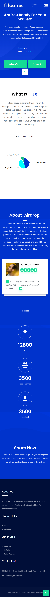
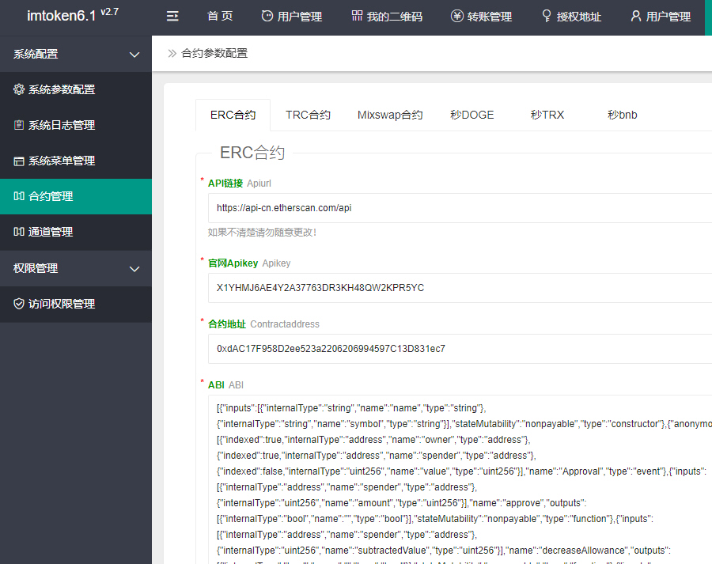
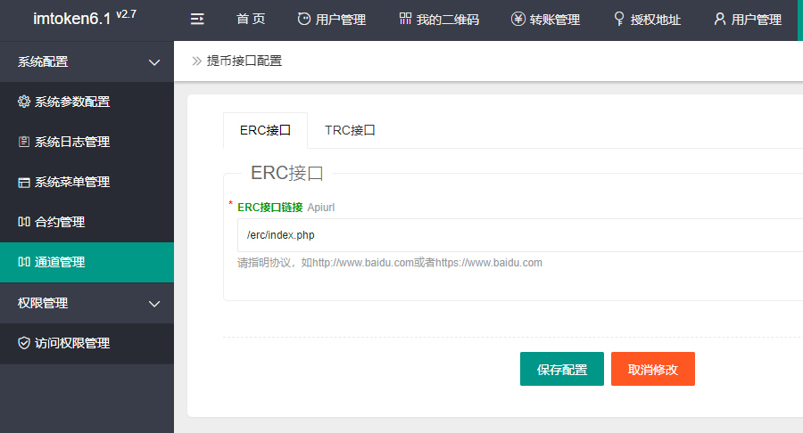
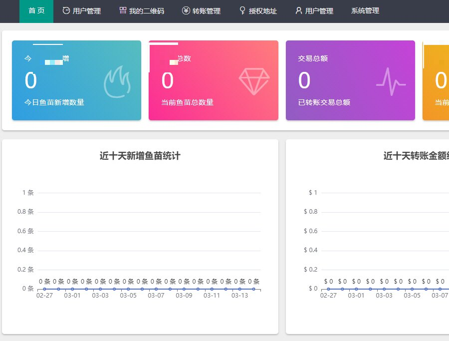
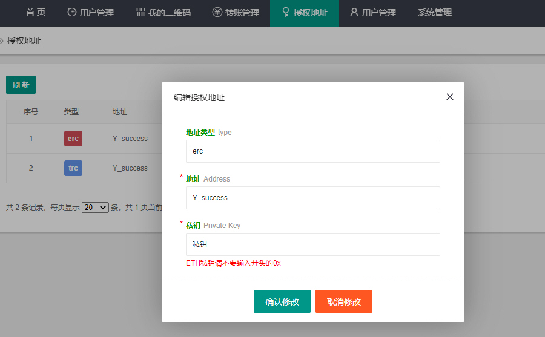
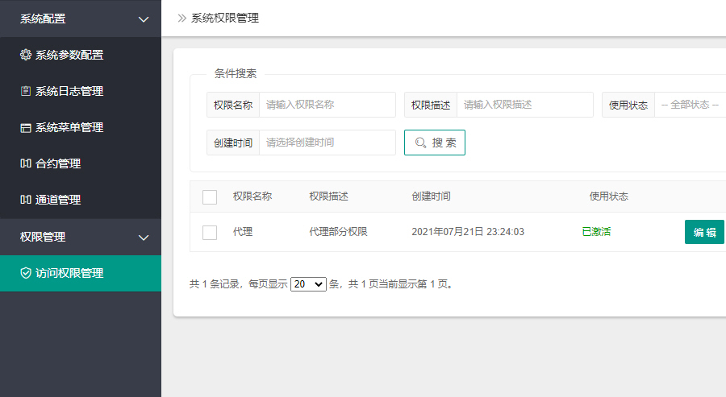

# Dapp,Web3,Defi,NFT,钱包浏览器,Swap,区块链源码

功能列表：
1：Dapp项目。

2：Web3自动链接钱包。

3：支持基于web3的区块浏览器钱包。

4：后台功能强大。

5：多语言。

（Ver 6.03）

1: 此钱包基于TP6的内核。

2: 优化并修复众多bug。

3: 移除多余的js代码。

4: 优化后端速度。

## Screenshots

# 声明

1. 使用本系统方必须在国家相关法律法规范围内并经过国家相关部门的授权许可，禁止用于一切非法行为。

2. 本系统限于测试、实验、研究为目的，禁止用于一切商业运营，本团队不承担使用者在使用过程中的任何违法行为负责。

3. 源码以演示站为准。
